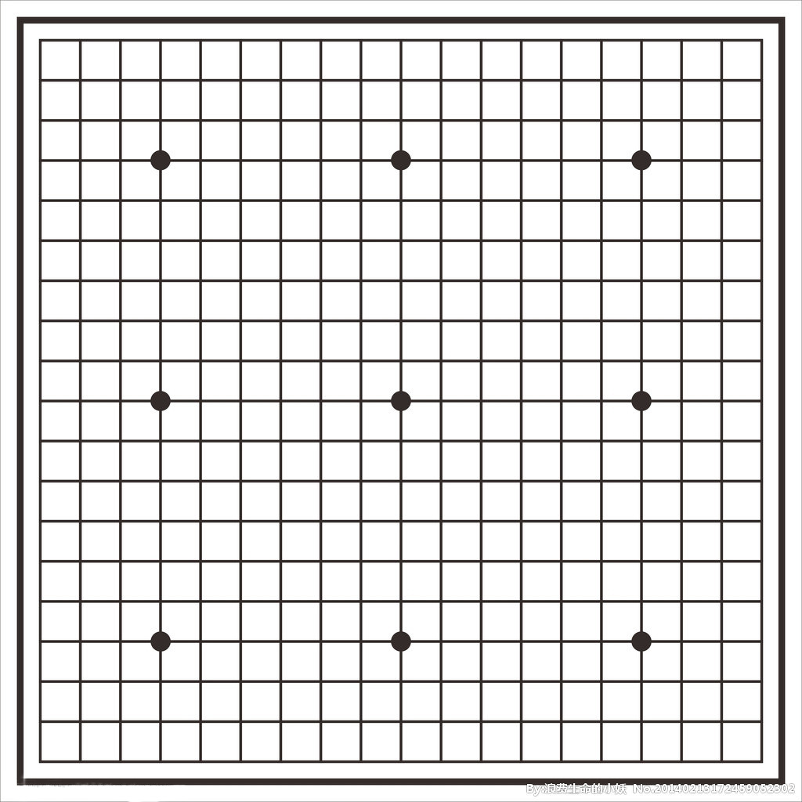

### 棋盘简介

五子棋游戏的棋盘同围棋相同,如下图所示,棋盘中间一点为 __天元__。棋盘两端的横线称为 __端线__。棋盘左右最外边的两条纵线称为 __边线__。从两条端线和两条边线向中央发展而纵横交叉的第4条线形成的4个点称为 __星__。天元和星应在棋盘上用直径约为0.5厘米的实心小点标出。

以持黑方为准,棋盘上的纵线从左到右用英文字母A~O标记。横线从近到远用阿拉伯数字1~15标记。纵横线上的横纵交叉点分别用横纵线标记的名称合写成。如“天元”是H8,四个“星”分别是D4, D12, L12, L4等。
