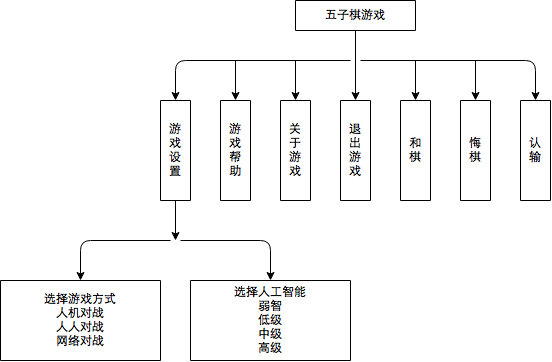

### 系统功能架构

模块名称 | 输入 | 处理 | 输出
---|---|---|---
胜负判定 | 当前棋局 | 从各个方向搜索黑白连珠个数 | 若连珠个数大于等于5，则输出胜负已分；否则，输出胜负未分
计算机下棋 | 当前棋局难易程度 | 计算黑白棋在各空位置下棋时的棋局评分 | 棋局评分最高的空位置
难易程度选择 | 用户选择的难易程度 | 置系统难易程度变量为相应值，计算机下棋时，用此变量表示棋局评分精度 | 无
悔棋 | 当前棋局 堆栈变量S | 更新棋局，S压栈 更新棋局显示 | 无
撤销悔棋 | 当前棋局 堆栈变量S | 更新棋局，S弹栈 更棋局新显示 | 无
网络对战 | 对方发送的下棋数据包 | 读取、解析下棋数据包 更新相应数据结构 更新棋局显示 发送下棋者下棋后封装的下棋数据包 | 下棋数据封装后的下棋数据包
文字聊天 | 对方发送的文字数据包 | 读取、解析文字数据包 更新文字显示 | 输入文字封装后的文字数据包

