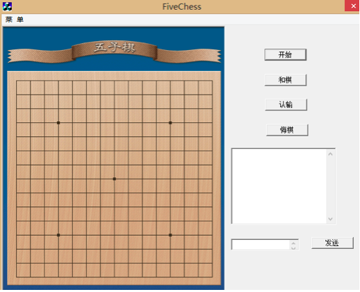
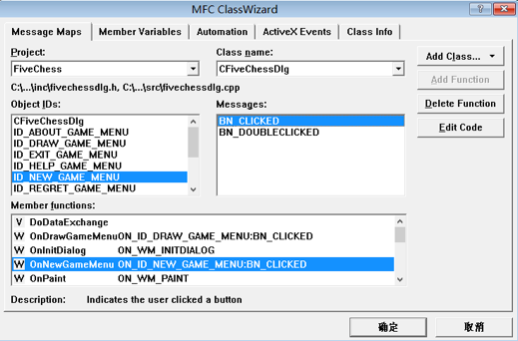

#### 棋盘界面

游戏一开始进入的是棋盘界面,如图所示：


棋盘旁边设置了开始、和棋、认输、悔棋四个功能按钮, 下面是网络对话框.

<div style="page-break-after: always;"></div>
为每个按钮添加类向导:



并在CFivechessDlg.cpp中实现每个按钮的响应函数.
开始按钮的响应函数
```cpp
void CFiveChessDlg::OnNewGameMenu() {
    char str[128] = {0};
    GetPrivateProfileString("WEB",
                    "START",
                    "",
                    str,
                    127,
                    ".\\config.ini");
    if(strcmp(str, "true") == 0) {
        if(IDOK == m_setup_dlg.DoModal()) {
            Restart();
            NewGameStart(n_setup_dlg.m_isHost);
        }
    }
}
```

鼠标左键点击开始按钮时,首先从文件夹中的config_.ini文件中读取游戏设置的数据
如果选择的是网络对战,则用DoModal()函数调用网络设置对话框,否则不调用。

其余按钮的响应函数的实现参见源代码。
