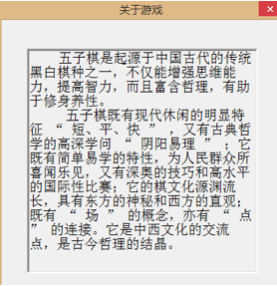

#### 关于游戏

关于游戏的响应函数如下：
```cpp
void CFiveChessDlg::OnUpdateAboutGameMenu(CCmdUI* pCmdUI) {
    m_aboutgame.DoModal();
    // TODO: Add your command update UI handler code here
}
```
其中m_aboutgame是游戏帮助CAboutgameDlg类的一个对象。

鼠标左键点击游戏中设置时,弹出窗口如下图所示。


