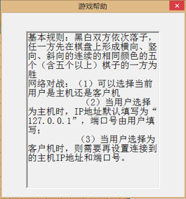

#### 游戏帮助
游戏帮助的响应函数如下：

```cpp
void CFiveChessDlg::OnUpdateHelpGameMenu(CCmdUI* pCmdUI) {
    m_helpgame.DoModal();
    // TODO: Add your command update UI handler code here
}
```

其中m_helpgame是游戏帮助CHelpgameDlg类的一个对象。

鼠标左键点击游戏中设置时,弹出窗口如下图所示。


