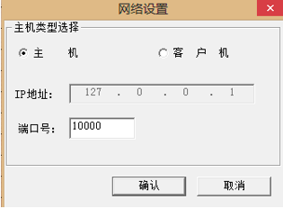

#### 网络设置

网络设置对话框的弹出是在游戏设置里面,当用户选择网络对战,并按下开始按钮发生的。
其包含的内容如下:
- 可以选择当前用户是主机,还是客户机。如果是主机则执黑子,如是客户机则执白子

- 当用户选择为主机时,IP地址默认填写为“127.0.0.1”,端口号由用户填写

- 当用户选择为客户机时,则需要再设置连接到的主机IP地址及端口号

- 如果前面已经设置过,则需要单击“开始”选项时,把上一次设置的IP地址和端口号显示出来

来弹出窗口如下图所示:



<div style="page-break-after: always;"></div>
确定按钮的响应函数如下:
```cpp
void CSetupDlg::OnOK() {
    CString strIP, strPort;

    UpdateData(TRUE);
    m_ip_addr.GetWindowText(strIP);
    m_strHostIP = strIP;
    strPort.Format("%d", m_net_port);
    if(m_isHost) {
        WritePrivateProfileString("HOST", "PORT", strPort, ".\\config.ini");
    }
    else {
        WritePrivateProfileString("CLIENT", "IP", strIP, ".\\config.ini");
        WritePrivateProfileString("CLIENT", "PORT", strPort, ".\\config.ini");
    }
    CDialog::OnOK();
}
```
