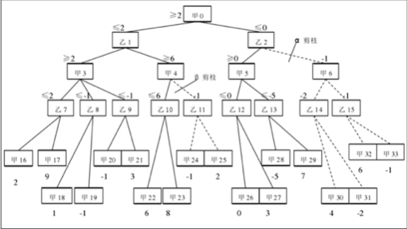
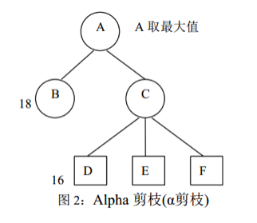
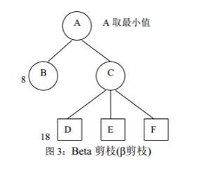

#### 基于博弈树搜索的alpha-beta剪枝算法

原理图：



从上面可以看出,原来要搜索34个节点,现在只要搜索21个就可以了,搜索量大大减少,而且也不会因为搜索量的减少,使得搜索结果有误。

我们把搜索过程中得到的极大节点X的候选倒推值 $$Pb(X)$$ 叫 $$\alpha$$ 值,它是 $$b(X)$$ 的下界,不可能再下降了。
而把极小节点Y的候选倒推值 $$Pb(Y)$$ 叫 $$\beta$$ 值,它是 $$b(Y)$$ 的上界,不可能再上升了。

在搜索过程中, $$\alpha$$ 和 $$\beta$$ 值按以下规律计算:
- 极大节点的 $$\alpha$$ 值等于当前子节点中的最大倒推值

- 极小节点的 $$\beta$$ 值等于当前子节点中的最小倒推值

alpha-beta 剪枝的规则如:
- 规则 1
当任何极小节点的 $$\beta$$ 值小于等于它的极大的祖先节点的 $$\alpha$$ 值时,则可以中止
该极小节点以下的搜索。该极小节点的最终倒推值即为它的 $$\beta$$ 值。

- 规则 2
当任何极大节点的 $$\alpha$$ 值大于等于它的极小的祖先节点的 $$\beta$$ 值时,则可以中止
该极大节点以下的搜索,该极大节点的最终倒推值等于它的 $$\alpha$$ 值。

<div style="page-break-after: always;"></div>
当按规则1停止搜索时,称产生alpha剪枝,如下图：



当按规则 2 停止搜索时,称产生beta剪枝。
如下图：



保存 $$\alpha$$、$$\beta$$值,并且当可能时进行剪枝的整个过程通常称为alpha-beta剪枝过程。

当开始节点的所有子节点都得到倒推值后,过程终止。
最佳首步移动是产生有最大倒推值的子节点的移动。
该过程产生的移动与简单使用极小极大过程搜索相同深度得到的方案是相似的。
唯一不同是,alpha-beta过程通常用少得多的搜索就可以找到最佳首步移动。

<div style="page-break-after: always;"></div>
alpha-beta 过程算法伪码如下：

```cpp
double alphabeta(int depth, double alpha, double beta, State s) {
    /* 计算局面s的最优值 */
    int i;
    double t;
    if (depth == 0) {
        return evaluate(p);     /* 叶节点 */
    }
    State c[w] = get_child_state(s);
    if(极大点) {
        for(i = 0; i < w; i++) {
            t = alphabeta(depth - 1; alpha, beta, c[i]);
            if(t > alpha) {
                if(t>beta) {
                    return t;
                }
                else {
                    alpha = t;
                }
            }
        }
        return alpha;
    }

    else {
        /* 极小点 */
        for(i = 0; i < w; i++) {
            t = alphabeta(depth - 1; alpha, beta, c[i]);
            if(t < beta) {
                if(t > alpha) {
                    return t;
                }
                else {
                    beta = t;
                }
            }
        }
        reutn beta
    }
}
```

从上述例子看,alpha-beta剪枝过程搜索效率与节点的排列顺序有很大关系。
对极大节点来说,越早搜索到极大的alpha值,则能够越早进行剪枝;
同样的,对极小节点来说,越早搜索到极小的beta值,就能越早结束后面的搜索过程。

最佳节点排序是不可能实现的(假如可实现,就完全不需要搜索过程了)。
在最糟糕的情况下,alpha-beta搜索不会产生剪枝,搜索分枝数不变。
实际上,假如将好的试探方法用于排列后继节点,alpha-beta过程通常可以最大程度地减少搜索分枝数。
由于五子棋以五子连在一起为胜,因此一个已有子周围的点是较有威胁的点,而且最后下的一子的周围点威胁性更大。
换而言之,这些点对极小节点来说,倒推值会相对较小,对极大节点来说,倒推值会相对大些。可将它们排在搜索队列前面,优先搜索。

博弈树搜索继承了贪心算法的优点,同时也在一定程度上克服了它的缺点。博弈树搜索能站在博弈双方的立场去分析局面,进而得出最优的下子方案,这与人类的思维又更近了一步。但博弈树搜索最大的限制是博弈树中指数级增长的节点数,过多的节点限制了搜索的深度。想加深搜索的深度,则必须对搜索算法进行优化和剪枝,于是有了alpha-beta剪枝和其他优化方法。另外,评估函数的好坏,也对博弈树搜索至关重要,使得博弈树搜索带有主观因素。
