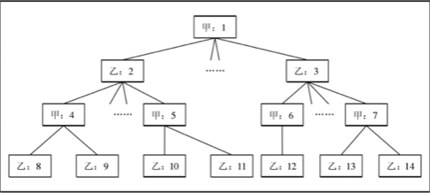
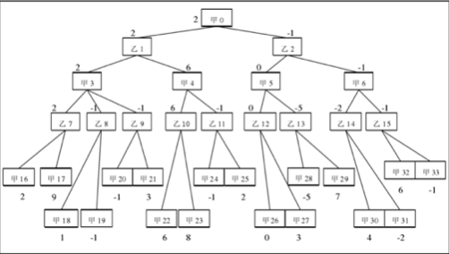

#### 博弈树算法

在五子棋游戏中,黑白双方轮流下子,产生了不同的棋盘局面。

对一个局面来说,往往有若干种合法的下法可以应对。
假设黑方下了第一步棋,轮到白方的时候,就有224种落子方式,每种方式都将产生不同的棋局;
白方选择其中一步以应对,黑方则又有223种方案和223种局面……

将这些局面以树的形式组织起来,就形成了博弈。如图所示：



博弈树最终的叶节点有黑赢、白赢和平手三种。
下棋者总是从当前局面出发,选择最有利于自己的走法。

为了从很多的局面中选出最优的,就需要一个搜索算法和一个对局面进行形势判断的函数。
搜索算法通常使用极大极小值算法、alpha-beta剪枝技术等,而评估函数通常不是固定,不同人有不同的标准和想法。
搜索算法的好坏决定了计算机能够“想多远”;评估函数的优劣则决定博弈程序棋力的高低。

博弈树是一种N叉树结构,假设每个局面都只有不超过10种可用的下法,则此时N = 10。
又假设黑白双方在 40 步内能完成一盘游戏,则博弈树的最大深度 D=40。容易得知博弈树的最大节点数为$$N^{(D+1)-(N-1)}$$,约 $$10^{41}$$个局面。

现实情况下N和D的值会大得多,所以一棵完整的博弈树所拥有的节点是非常多的。我们不可能去搜索整棵博弈树,也不可能存储它。

<div style="page-break-after: always;"></div>
因此,对博弈树的搜索到一定深度就不再往下走了,根据一个评估函数f,对局势进行评判,用估计值代替实际的搜索。
f函数是从某一方(如黑方)的立场出发的,估计值越大,对己方越有利;估计值越小,对对方越有利。

$$ f(x) = \begin{cases}
+\infty \\
-\infty \\
x, x \in (-\infty, +\infty)
\end{cases}$$

一个最佳走步可以由一个极小极大化过程产生,甲方要从搜索树局势0的叶节点中选取,甲方肯定要选择拥有最大值的节点。
因此,一个标有“甲”的节点的估计值可以由它的标有“乙”的子节点的最大值确定。

另一方面,乙方从叶节点选时,由于估计值越小对它越有利,因此必然选取估计值值最小的节点(即最小的估计值)。
因此,标有“乙”的节点估计值可由它的标有“甲”的子节点的最小值确定。

综合以上两方面,可从博弈树的叶节点出发,一层层倒推得到上一层的估计值,直到得出根节点的估计值,这样就可以确定从根节点出发的最佳走步。由于这样,也称叶节点以上的各节点的值为倒推值。



在上图的博弈树中,从局面 1 出发,展开了两层,假设已经由估值函数计算局面16到34的估计值,写在节点下方。
现在来看看甲方在局势0如何根据博弈树选择最佳走法。

首先可由估值函数f计算出叶节点形势甲16到甲33的估分值,已标在节点下方。然后根据上述原则,确定深度为3的节点乙7到乙15的倒推值。
如乙7局势是轮到乙方下棋,要从子节点甲16、甲17及甲18中选择有最小估值的形势做为走步。
在这里,f(甲16) < f(甲17), 因此选f(甲16) = 2 做为乙7的倒推值, 即乙7形势下, 乙选甲16做为下一走步。

同样道理,可以得到乙 8 到乙 15 节点的倒推值,标在节点旁边。

再次,我们要确定深度为2的节点甲3到甲6的倒推值。如甲3局势下轮到甲方选择最佳走步,他要从子节点乙7到乙9中选择有最大值的为他的下一走步。这里 2>-1,因此甲3的倒推值取2,即甲方在局势3时应选乙7做为下一走步。

同理甲4到甲6也取子节点估值的最大值,它们的倒推值也标在节点旁边。
再次,乙1、乙2同理选择子节点估值的最小值作为倒推值,分别为2和-1。

最后,我们看根节点甲0,甲在局势0下选择具有最大估值的子节点乙1做为他的最佳走步。

整个过程有效性基于这样的假设:开始节点的后继的倒推值比直接从静态评估函数中得到的值更可靠。
由于倒推值基于在博弈树中的预先推算,并且取决于在博弈结束时发生的一些特性,这些值往往更加切合实际。

实际上可以看出,问题转化为对某一局面下衍生出的极大极小树的遍历。这种遍历用一个深度优先搜索就可以处理了。在搜索的过程中,当前路径上的每一个结点上都保存着搜索到目前为止的当前最优值。搜索用一个递归函数实现,该函数的功能是计算某个节点的最优值。每当一个结点得到子节点的返回值时,就从当前最优值和返回值中选取一个更优的值作为当前最优值。当一个节点的子节点都搜索完毕之时,其当前最优值就是该节点的实际最优值,也就是这个节点的得分。这时,将这个值返回其父节点。

下面给出极大极小搜索的伪代码:

```cpp
double minimax(int depth, State s) {
    /* 计算局面s的分值 */
    int i;
    double f, t
    if(depth == 0) {
        return evaluate(p);	/* 叶节点*/
    }
    State c[2] = get_chikd_state(s); /* 获取子局面 */
    if(电脑下棋) {
        f = -INF; /* 求f的最大值,设为无穷小 */
    }
    else {
        f = INF /* 求f的最小值,设为无穷大 */
    }

    for(i = 0; i < w; i++) {
        if(t > f && 电脑下棋) {
            f = t
        }
        if(t < f && 对手下棋) {
            f=t
        }
    }
    return f;
}
```

上述的极小极大值搜索过程中,遍历了整棵的博弈树,每一个节点都访问了一次,这样的搜索算法粗糙,效率低下,搜索量非常大。
但如果要减少搜索量,就可能影响搜索效果。
假如将叶节点的评估,计算倒推值与树的产生同时进行,就可能大量减少所需搜索的节点数目,而且保持搜索效果不变。
这个技术叫 alpha-beta 剪枝过程。
