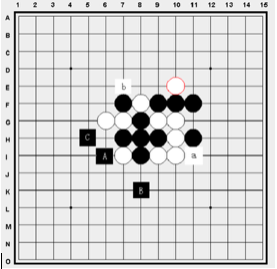

#### 其他人工智能算法
##### 结合遗传算法
生物的进化是一个奇妙的优化过程,它通过选择淘汰,突然变异,基因遗传等规律产生适应环境变化的优良物种。

遗传算法是根据生物进化思想而启发得出的一种全局优化算法。
遗传算法的概念最早是由Bagley J.D在1967年提出的;而开始遗传算法的理论和方法的系统性研究的是1975年,
这一开创性工作是由Michigan大学的J.H.Holland所实行。
当时,其主要目的是说明自然和人工系统的自适应过程。

遗传算法简称GA(GeneticAlgorithm),在本质上是一种不依赖具体问题的直接搜索方法。
遗传算法在模式识别、神经网络、图像处理、机器学习、工业优化控制、自适应控制、生物科学、社会科学等方面都得到应用。
在人工智能研究中,现在人们认为,遗传算法、自适应系统、细胞自动机、混沌理论与人工智能一样,都是对今后十年的计算技术有重大影响的关键技术。

##### 结合神经网络
人工神经网络ANNs(Artificial Neural Networks)也简称为神经网络NNs(Neural Networks)或称作连接模型(Connectionist Model),
是对人脑或自然神经网络(Natural Neural Network)若干基本特性的抽象和模拟。

人工神经网络以对大脑的生理研究成果为基础的,其目的在于模拟大脑的某些机理与机制,实现某个方面的功能。
国际著名的神经网络研究专家,第一家神经计算机公司的创立者与领导人Hecht Nielsen给人工神经网络下的定义就是:“人工神经网络是由人工建立的以有向图为拓扑结构的动态系统,它通过对连续或断续的输入作状态相应而进行信息处理。”这一定义是恰当的。

人工神经网络的研究,可以追溯到1957年Rosenblatt提出的感知器模型(Perceptron)。
它几乎与人工智能——AI(Artificial Intelligence)同时起步,但30余年来却并未取得人工智能那样巨大的成功,中间经历了一段长时间的萧条。
直到80年代,获得了关于人工神经网络切实可行的算法,以及以Von  Neumann体系为依托的传统算法在知识处理方面日益显露出其力不从心后,
人们才重新对人工神经网络发生了兴趣,导致神经网络的复兴。目前在神经网络研究方法上已形成多个流派,

最富有成果的研究工作包括:
- 多层网络BP(BackPropagation)算法

- Hopfield网络模型

- 自适应共振理论

- 自组织特征映射理论等

人工神经网络是在现代神经科学的基础上提出来的。
它虽然反映了人脑功能的基本特征,但远不是自然神经网络的逼真描写,而只是它的某种简化抽象和模拟。

##### 连续冲四搜索
下过五子棋的人都知道,冲四是很强的攻击手段。
如果对手在上一步连成了冲四,那么这一步轮到自己的时候就必须阻止对手成连;否则,除非是自己成连,不然对方将在下一步获胜。
连续冲四取胜,即是在连续冲四的情况下,使对手没有反驳的机会而获胜的手段。
一般是在连续冲四的情况下构造出活四或“四三”组合棋形。
只要形成了这种强大的、具有强制性的进攻,即使对手已经有了稍弱一点的攻势,、或者是在连续冲四的进攻途中对手会形成其他弱一等的攻势,都将无济于事了。
因为自己一方已经在连续冲四的进攻中,形成了胜势。



这是一个连续冲四的例子。假设现在轮到黑棋下子,在这个棋局中,白棋已经形成一个活三。在一般情况下,黑方很可能选择封锁白方的活三,即a 位置或b位置。而在两个位置中,a更为有利,因为在封锁对方活三的同时,给自己形成了活三。若此时黑棋落在a点,而白方回应下一步肯定是阻止黑活四形成,并形成新的白活三,黑棋仍处于被动的状态,在可预见的几步内,黑棋将失败。但如果此时黑棋置白活三不顾,落在A处形成冲四,白棋则不得不防住这冲四。黑棋紧接着走B、C连续冲四,进而连接A、B、C三点形成活四,黑棋获胜。

<div style="page-break-after: always;"></div>
连续冲四搜索算法伪代码实现:

```cpp
BOOL vct_search(State s) {
    if(have_live_four(s)) {
        // 检查当前局面是否有活四
        return TRUE;
    }

    pos_list[w] = get_dead_four_list(s);        //获取冲四的位置列表
    for(i = 0; i < w; i++) {
        response = get_opp_response(s, pos_list[i]);
        // 计算这步后, 对手回应位置
        if(is_opp_four(s, response)) {
            // 对手因回应变成进攻状态
            continue;       // 不走这一步
        }
        put(s, pos_list[i]);        // 尝试放在此步;
        if(vct_search(s) == TRUE) {
            // 递归搜索
            return TRUE;
        }
        unput(s, pos_list[i]);      //恢复原来的状态
    }
    return FALSE;       //搜搜不到结果
}
```
